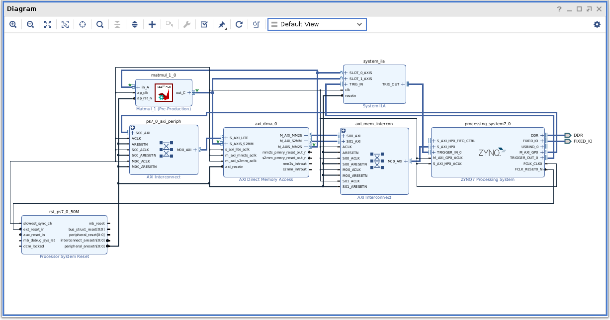
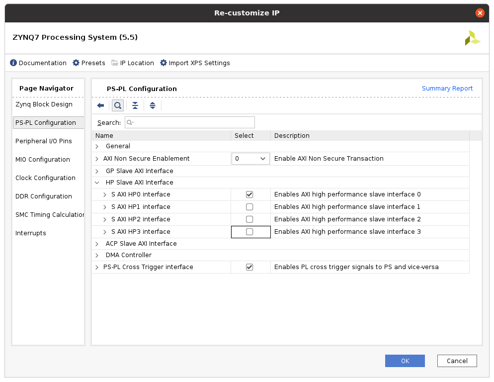
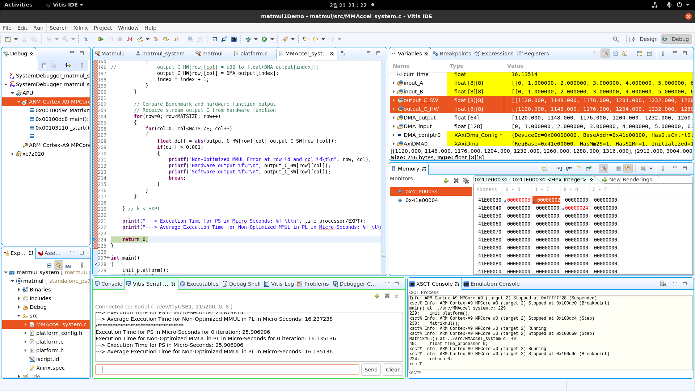

# HLS4Matmul

2023.02.21

## HLS code for simple unoptimized matrix multiplications (Initial Try for Learning HLS)
- Jeong-Gun Lee / Hallym University



### * Note

1. Zynq Processor Configuration: Keep in mind that we have to enable the use of HP ports for utilizing DMA.




2. DMA transfer data are typed as u32. Sometimes, we need to special functions to translate u32 to/from float.
```C
unsigned int float_to_u32(float val)
{
	unsigned int result;
	union float_bytes {
		float v;
		unsigned char bytes[4];
	} data;

	data.v = val;

	result = (data.bytes[3] << 24) + (data.bytes[2] << 16) + (data.bytes[1] << 8) + (data.bytes[0]);

	return result;
}

unsigned int u32_to_float(unsigned int val)
{
	union {
		float val_float;
		unsigned char bytes[4];
	} data;

	data.bytes[3] = (val >> (8*3)) & 0xff;
	data.bytes[2] = (val >> (8*2)) & 0xff;
	data.bytes[1] = (val >> (8*1)) & 0xff;
	data.bytes[0] = (val >> (8*0)) & 0xff;

	return data.val_float;
}
```

### * Overal Development Environment of Vitis-IDE.


### * Next Mission: Try to optimize the MM Accelerator with further memory optimization or bitwidth optimization.
